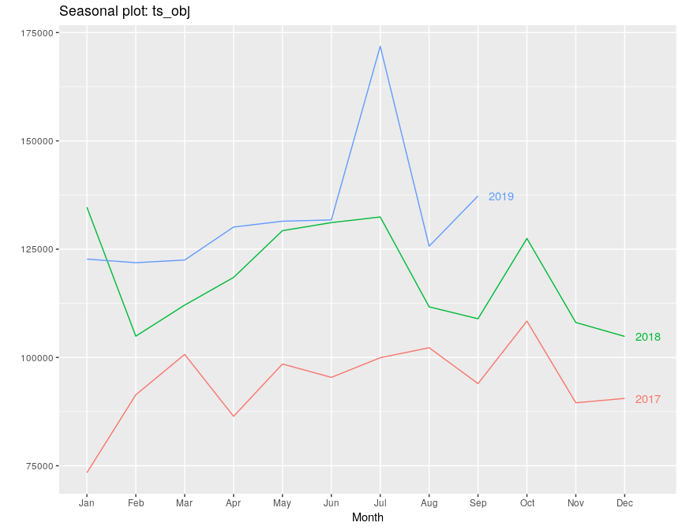

FDA Drug Adverse Events - Data Exploration
================
rstudio
February 10, 2020

\#’

## 

### How many Records per day?

  - **Just for this section, let’s keep the timeframe to Jan 2017 to
    2019 Q3**
  - There is an API that returns a timeseries - let’s use it
  - Ref:
<https://open.fda.gov/apis/timeseries/>

<!-- end list -->

    ## [1] "2017-01-01" "2019-09-30"

<!-- --><!-- --><!-- -->

### Explore 2019 Q3 data

  - **This analysis is primarily restricted to events within 2019 Q3.**

<!-- end list -->

    ## Observations: 441,477
    ## Variables: 39
    ## $ receivedate                              <chr> "20190408", "20190408",…
    ## $ receivedateformat                        <chr> "102", "102", "102", "1…
    ## $ transmissiondate                         <chr> "20191004", "20191004",…
    ## $ fulfillexpeditecriteria                  <chr> "2", "1", "1", "2", "2"…
    ## $ occurcountry                             <chr> "US", "HU", "FR", "US",…
    ## $ receiptdate                              <chr> "20190808", "20190705",…
    ## $ transmissiondateformat                   <chr> "102", "102", "102", "1…
    ## $ receiptdateformat                        <chr> "102", "102", "102", "1…
    ## $ duplicate                                <chr> "1", "1", "1", "1", "1"…
    ## $ reporttype                               <chr> "2", "2", "2", "1", "1"…
    ## $ serious                                  <chr> "2", "1", "1", "2", "2"…
    ## $ safetyreportversion                      <chr> "4", "2", "3", "2", "2"…
    ## $ companynumb                              <chr> "PHEH2019US014292", "US…
    ## $ safetyreportid                           <chr> "16167673", "16171472",…
    ## $ primarysourcecountry                     <chr> "US", "US", "FR", "US",…
    ## $ seriousnessother                         <chr> NA, "1", "1", NA, NA, N…
    ## $ seriousnesshospitalization               <chr> NA, NA, NA, NA, NA, NA,…
    ## $ seriousnessdeath                         <chr> NA, NA, NA, NA, NA, NA,…
    ## $ seriousnessdisabling                     <chr> NA, NA, NA, NA, NA, NA,…
    ## $ authoritynumb                            <chr> NA, NA, NA, NA, NA, NA,…
    ## $ seriousnesslifethreatening               <chr> NA, NA, NA, NA, NA, NA,…
    ## $ seriousnesscongenitalanomali             <chr> NA, NA, NA, NA, NA, NA,…
    ## $ patient.reaction                         <list> [<data.frame[4 x 3]>, …
    ## $ patient.patientsex                       <chr> "1", NA, "2", "2", "2",…
    ## $ patient.drug                             <list> [<data.frame[1 x 28]>,…
    ## $ patient.patientonsetage                  <chr> NA, NA, "84", "68", "58…
    ## $ patient.patientweight                    <chr> NA, NA, "63", NA, NA, N…
    ## $ patient.patientonsetageunit              <chr> NA, NA, "801", "801", "…
    ## $ patient.patientagegroup                  <chr> NA, NA, NA, "6", NA, NA…
    ## $ patient.summary.narrativeincludeclinical <chr> NA, NA, "CASE EVENT DAT…
    ## $ sender.senderorganization                <chr> "FDA-Public Use", "FDA-…
    ## $ sender.sendertype                        <chr> "2", "2", "2", "2", "2"…
    ## $ primarysource.reportercountry            <chr> "US", "HU", "FR", "US",…
    ## $ primarysource.qualification              <chr> "3", "1", "1", "5", "5"…
    ## $ primarysource.literaturereference        <chr> NA, NA, NA, NA, NA, NA,…
    ## $ reportduplicate.duplicatenumb            <chr> "PHEH2019US014292", "US…
    ## $ reportduplicate.duplicatesource          <chr> "NOVARTIS", "SUNOVION",…
    ## $ receiver.receiverorganization            <chr> "FDA", "FDA", "FDA", "F…
    ## $ receiver.receivertype                    <chr> "6", "6", "6", "6", "6"…

  - Number of Unique reports received by FDA: 441477

  - Timerange of reports received

  - Note that receiptdate is Date that the most recent information in
    the report was received by FDA

  - Range of receiptdate: 20190701, 20190930

  - receivedate is Date that the report was first received by FDA. If
    this report has multiple versions, this will be the date the first
    version was received by FDA.

  - Range of receivedate: 20030123, 20190930

<!-- end list -->

    ## # A tibble: 17 x 2
    ##    receivedate_year NumReports
    ##               <dbl>      <int>
    ##  1             2019     405273
    ##  2             2018      22888
    ##  3             2017       6665
    ##  4             2016       3532
    ##  5             2015       1448
    ##  6             2014        728
    ##  7             2013        431
    ##  8             2012        252
    ##  9             2011        104
    ## 10             2010         65
    ## 11             2009         36
    ## 12             2007         18
    ## 13             2008         14
    ## 14             2006         12
    ## 15             2005          7
    ## 16             2003          3
    ## 17             2004          1

  - **Makes sense to keep reports received in year 2019**

#### Gender, Age, Weight

    ## # A tibble: 4 x 3
    ##   gender  NumReports FractionReports
    ##   <chr>        <int> <chr>          
    ## 1 Female      222160 55%            
    ## 2 Male        130303 32%            
    ## 3 <NA>         52778 13%            
    ## 4 Unknown         32 0%

    ## # A tibble: 7 x 3
    ##   age_group  NumReports FractionReports
    ##   <chr>           <int> <chr>          
    ## 1 <NA>           360327 89%            
    ## 2 Adult           28446 7%             
    ## 3 Elderly         13132 3%             
    ## 4 Neonate          1079 0%             
    ## 5 Child             950 0%             
    ## 6 Adolescent        920 0%             
    ## 7 Infant            419 0%

    ##   NoWeightInfo HasWeightInfo HasWeight_Fraction
    ## 1       332126         73147              18.0%

<!-- -->

#### Adverse Events and Occuring countries

  - Let’s attempt to answer if different adverse events are reported in
    different countries?
  - Adverse Events definition is available
    here:<https://www.fda.gov/safety/reporting-serious-problems-fda/what-serious-adverse-event>
  - 1 = The adverse event resulted in death, a life threatening
    condition, hospitalization, disability, congenital anomaly, or other
    serious condition
  - 2 = The adverse event did not result in any of the above

<!-- end list -->

    ## 
    ##      1      2 
    ## 218529 186744

  - Number of distinct countries where events occured: 169

<!-- end list -->

    ## 
    ##     US     CA     FR     JP     GB     DE     IT     CN     ES     BR 
    ## 274084  22571  15843  13631  12840  12216   7273   4621   4499   3432 
    ##     AU     CO     NL     SE     PL     PT     AR     BE     IN     TR 
    ##   3132   2751   2143   1556   1509   1467   1308   1231   1226    960 
    ##     GR     KR     TW     AT     CH     IL     CZ     RO     MX     IE 
    ##    918    861    859    810    780    760    686    685    683    646 
    ##     ZA     RU     DK     HU     FI     CL     PR     NO     SG     HR 
    ##    619    616    584    415    377    365    347    342    335    315 
    ##     EG     NZ     IR     PK     SK     LB     HK     TH     PH     BG 
    ##    296    238    225    225    225    219    201    200    180    176 
    ##     MY     SI     CR     SA     GT     PE     AE     ID     LT     VN 
    ##    172    161    138    126    115    115    104     96     93     89 
    ##     EC     BW     UA     DO     TN     NG     KW     PA     RS     UY 
    ##     82     74     69     64     64     61     60     60     59     57 
    ##     HN     KE     UG     OM     EE     DZ     MA     LV     NP     BY 
    ##     54     52     52     49     48     37     36     33     27     26 
    ##     MM     KZ     QA     CY   <NA>     JO     BD     IS     LU     LK 
    ##     26     23     22     21     20     18     17     17     16     15 
    ##     VE     GE     MW     CM     PY     UM     ZW     BA     BO     CU 
    ##     15     14     14     11     11     11     11     10      8      8 
    ##     ET     GH     IQ     KP     ME     MT     BH     JM     MK     UZ 
    ##      8      8      8      8      8      8      7      7      7      7 
    ##     AL     CI     ML     SV     TJ     NE     RW     SN     TT     BS 
    ##      6      6      6      6      6      5      5      5      5      4 
    ##     KY     SY     BJ     BM     BZ     CD     GA     MZ     NI     AD 
    ##      4      4      3      3      3      3      3      3      3      2 
    ##     AF     AX     AZ     BB     BN     FJ     GU     HT     KH     MO 
    ##      2      2      2      2      2      2      2      2      2      2 
    ##     NA     AM     BF     BI     CG     CX     DM     FO     GN     GP 
    ##      2      1      1      1      1      1      1      1      1      1 
    ##     IM     LR     LY     MC     MD     MG     MN     NC     PG     PN 
    ##      1      1      1      1      1      1      1      1      1      1 
    ##     PS     QZ     SD     SZ     TM     TZ     VU     WS     XK 
    ##      1      1      1      1      1      1      1      1      1

  - Top 20 occuring countries with names

<!-- end list -->

    ## 
    ##  United States         Canada         France          Japan United Kingdom 
    ##         274084          22571          15843          13631          12840 
    ##        Germany          Italy          China          Spain         Brazil 
    ##          12216           7273           4621           4499           3432 
    ##      Australia       Colombia    Netherlands         Sweden         Poland 
    ##           3132           2751           2143           1556           1509 
    ##       Portugal      Argentina        Belgium          India         Turkey 
    ##           1467           1308           1231           1226            960

<!-- -->

    ## # A tibble: 2 x 2
    ##   serious NumCountries
    ##   <chr>          <int>
    ## 1 1                165
    ## 2 2                 83

    ## # A tibble: 6 x 3
    ##   category                     NumReports FractionSerious1
    ##   <chr>                             <int> <chr>           
    ## 1 seriousnessother                 147224 67.4%           
    ## 2 seriousnesshospitalization        85639 39.2%           
    ## 3 seriousnessdeath                  28067 12.8%           
    ## 4 seriousnesslifethreatening        10374 4.7%            
    ## 5 seriousnessdisabling               5197 2.4%            
    ## 6 seriousnesscongenitalanomali       1643 0.8%

#### Adverse Reactions and Occuring countries

  - What are different adverse reactions?

  - Number of distinct adverse reactions: 11518

  - Let’s get what are the top 10 adverse reactions

<!-- -->

  - What are the top 5 countries for each of the top 10 adverse
    reactions?

<!-- end list -->

    ##     reactionmeddrapt           Name NumReports
    ##  1: Drug ineffective  United States      23574
    ##  2: Drug ineffective         Canada       4574
    ##  3: Drug ineffective United Kingdom        340
    ##  4: Drug ineffective          Italy        322
    ##  5: Drug ineffective        Germany        263
    ##  6:         Dry skin  United States      11270
    ##  7:         Dry skin         Canada        117
    ##  8:         Dry skin        Germany         32
    ##  9:         Dry skin United Kingdom         28
    ## 10:         Dry skin         Brazil         21
    ## 11:         Erythema  United States      10588
    ## 12:         Erythema         Canada        470
    ## 13:         Erythema         France        220
    ## 14:         Erythema        Germany        124
    ## 15:         Erythema          Italy        124
    ## 16:    Off label use  United States      10146
    ## 17:    Off label use         Canada       1638
    ## 18:    Off label use         France        579
    ## 19:    Off label use          Japan        428
    ## 20:    Off label use        Germany        391
    ## 21:          Fatigue  United States      10058
    ## 22:          Fatigue         Canada       2049
    ## 23:          Fatigue        Germany        655
    ## 24:          Fatigue United Kingdom        608
    ## 25:          Fatigue         France        180
    ## 26:           Nausea  United States       9710
    ## 27:           Nausea         Canada       1826
    ## 28:           Nausea        Germany        783
    ## 29:           Nausea United Kingdom        568
    ## 30:           Nausea         France        309
    ## 31:             Rash  United States       8548
    ## 32:             Rash         Canada        888
    ## 33:             Rash         France        256
    ## 34:             Rash          Japan        242
    ## 35:             Rash United Kingdom        224
    ## 36:        Diarrhoea  United States       8489
    ## 37:        Diarrhoea         Canada       1407
    ## 38:        Diarrhoea        Germany        512
    ## 39:        Diarrhoea United Kingdom        505
    ## 40:        Diarrhoea         France        442
    ## 41:         Headache  United States       8218
    ## 42:         Headache         Canada       1419
    ## 43:         Headache        Germany        463
    ## 44:         Headache United Kingdom        458
    ## 45:         Headache         France        216
    ## 46:            Death  United States       8146
    ## 47:            Death         Canada       1042
    ## 48:            Death          Japan        398
    ## 49:            Death United Kingdom        390
    ## 50:            Death          China        311
    ##     reactionmeddrapt           Name NumReports

  - How many countries have these top 10 adverse reactions

<!-- -->

#### Adverse Events and disease areas

  - What are different adverse events associated with different disease
    conditions?
  - Disease areas can be identified from drugindication column within
    drug\_df
  - What are different disease areas?
  - Number of distinct disease areas: 6131

<!-- end list -->

    ##                       drugindication NumReports
    ##  1:                             ACNE      17382
    ##  2:             RHEUMATOID ARTHRITIS      15785
    ##  3:                     HYPERTENSION      11974
    ##  4:               MULTIPLE SCLEROSIS      11055
    ##  5:              PLASMA CELL MYELOMA      10949
    ##  6:                        PSORIASIS       9491
    ##  7: GASTROOESOPHAGEAL REFLUX DISEASE       7465
    ##  8:                             PAIN       7409
    ##  9:         TYPE 2 DIABETES MELLITUS       6284
    ## 10:            PSORIATIC ARTHROPATHY       5398

  - What are adverse events within top 10
diseases

<!-- --><!-- -->

#### Drugs frequent itemsets

  - What are the drugs frequently taken together

  - activesubstancename is the drug info

  - Number of distinct drugs: 5604

  - Our objective is to find out what drugs are commonly taken together.

  - We can use apriori algorithm from arules R package to identify
    frequent itemsets

<!-- end list -->

    ## transactions as itemMatrix in sparse format with
    ##  405273 rows (elements/itemsets/transactions) and
    ##  5603 columns (items) and a density of 0.0005596283 
    ## 
    ## most frequent items:
    ##                           ADAPALENE                           COSMETICS 
    ##                               36570                               32289 
    ## AVOBENZONE\\OCTISALATE\\OCTOCRYLENE                             ASPIRIN 
    ##                               31209                               15688 
    ##                       ACETAMINOPHEN                             (Other) 
    ##                               12404                             1142613 
    ## 
    ## element (itemset/transaction) length distribution:
    ## sizes
    ##      1      2      3      4      5      6      7      8      9     10 
    ## 211873  44657  45304  28946  14550  10878   8400   6960   5832   4831 
    ##     11     12     13     14     15     16     17     18     19     20 
    ##   4284   3344   2839   2205   1833   1548   1215   1011    786    679 
    ##     21     22     23     24     25     26     27     28     29     30 
    ##    503    441    356    248    264    215    184    158    109    113 
    ##     31     32     33     34     35     36     37     38     39     40 
    ##     93     87     59     52     52     41     37     30     33     23 
    ##     41     42     43     44     45     46     47     48     49     50 
    ##     23     23     19     12     11     12     11     10      6      3 
    ##     51     52     53     54     55     56     57     59     60     61 
    ##      6      6      7      6      5      3      5      4      5      4 
    ##     62     64     65     66     67     69     71     72     75     76 
    ##      1      1      1      2      1      1      1      3      1      3 
    ##     77     82    155 
    ##      2      1      1 
    ## 
    ##    Min. 1st Qu.  Median    Mean 3rd Qu.    Max. 
    ##   1.000   1.000   1.000   3.136   4.000 155.000 
    ## 
    ## includes extended item information - examples:
    ##                        labels
    ## 1             .ALPHA.-ASARONE
    ## 2 .ALPHA.-GLUCOSE-1-PHOSPHATE
    ## 3         .ALPHA.-LIPOIC ACID

<!-- --><!-- --><!-- -->

    ##      items                                                support    
    ## [1]  {AVOBENZONE\\OCTISALATE\\OCTOCRYLENE,SALICYLIC ACID} 0.025528471
    ## [2]  {COSMETICS,SALICYLIC ACID}                           0.026364944
    ## [3]  {ADAPALENE,SALICYLIC ACID}                           0.026693118
    ## [4]  {OMEPRAZOLE MAGNESIUM,PANTOPRAZOLE SODIUM}           0.008073570
    ## [5]  {LANSOPRAZOLE,OMEPRAZOLE MAGNESIUM}                  0.010045081
    ## [6]  {ESOMEPRAZOLE MAGNESIUM,OMEPRAZOLE MAGNESIUM}        0.010888956
    ## [7]  {ESOMEPRAZOLE MAGNESIUM,PANTOPRAZOLE SODIUM}         0.008436289
    ## [8]  {ESOMEPRAZOLE MAGNESIUM,LANSOPRAZOLE}                0.011199858
    ## [9]  {AVOBENZONE\\OCTISALATE\\OCTOCRYLENE,COSMETICS}      0.076133865
    ## [10] {ADAPALENE,AVOBENZONE\\OCTISALATE\\OCTOCRYLENE}      0.076997481
    ##      count
    ## [1]  10346
    ## [2]  10685
    ## [3]  10818
    ## [4]   3272
    ## [5]   4071
    ## [6]   4413
    ## [7]   3419
    ## [8]   4539
    ## [9]  30855
    ## [10] 31205

<!-- -->

    ##                                                                       items
    ## 1                                                     {ADAPALENE,COSMETICS}
    ## 2                           {ADAPALENE,AVOBENZONE\\OCTISALATE\\OCTOCRYLENE}
    ## 3                           {AVOBENZONE\\OCTISALATE\\OCTOCRYLENE,COSMETICS}
    ## 4                 {ADAPALENE,AVOBENZONE\\OCTISALATE\\OCTOCRYLENE,COSMETICS}
    ## 5                                                {ADAPALENE,SALICYLIC ACID}
    ## 6                                                {COSMETICS,SALICYLIC ACID}
    ## 7                                      {ADAPALENE,COSMETICS,SALICYLIC ACID}
    ## 8                      {AVOBENZONE\\OCTISALATE\\OCTOCRYLENE,SALICYLIC ACID}
    ## 9            {ADAPALENE,AVOBENZONE\\OCTISALATE\\OCTOCRYLENE,SALICYLIC ACID}
    ## 10           {AVOBENZONE\\OCTISALATE\\OCTOCRYLENE,COSMETICS,SALICYLIC ACID}
    ## 11 {ADAPALENE,AVOBENZONE\\OCTISALATE\\OCTOCRYLENE,COSMETICS,SALICYLIC ACID}
    ## 12                                    {ESOMEPRAZOLE MAGNESIUM,LANSOPRAZOLE}
    ## 13                            {ESOMEPRAZOLE MAGNESIUM,OMEPRAZOLE MAGNESIUM}
    ## 14                                      {LANSOPRAZOLE,OMEPRAZOLE MAGNESIUM}
    ## 15               {ESOMEPRAZOLE MAGNESIUM,LANSOPRAZOLE,OMEPRAZOLE MAGNESIUM}
    ## 16                             {ESOMEPRAZOLE MAGNESIUM,PANTOPRAZOLE SODIUM}
    ## 17                               {OMEPRAZOLE MAGNESIUM,PANTOPRAZOLE SODIUM}
    ##        support count
    ## 1  0.079610534 32264
    ## 2  0.076997481 31205
    ## 3  0.076133865 30855
    ## 4  0.076126463 30852
    ## 5  0.026693118 10818
    ## 6  0.026364944 10685
    ## 7  0.026360009 10683
    ## 8  0.025528471 10346
    ## 9  0.025528471 10346
    ## 10 0.025340943 10270
    ## 11 0.025340943 10270
    ## 12 0.011199858  4539
    ## 13 0.010888956  4413
    ## 14 0.010045081  4071
    ## 15 0.009344319  3787
    ## 16 0.008436289  3419
    ## 17 0.008073570  3272

    ## R version 3.6.0 (2019-04-26)
    ## Platform: x86_64-pc-linux-gnu (64-bit)
    ## Running under: Ubuntu 18.04.2 LTS
    ## 
    ## Matrix products: default
    ## BLAS:   /usr/lib/x86_64-linux-gnu/openblas/libblas.so.3
    ## LAPACK: /usr/lib/x86_64-linux-gnu/libopenblasp-r0.2.20.so
    ## 
    ## locale:
    ##  [1] LC_CTYPE=C.UTF-8       LC_NUMERIC=C           LC_TIME=C.UTF-8       
    ##  [4] LC_COLLATE=C.UTF-8     LC_MONETARY=C.UTF-8    LC_MESSAGES=C.UTF-8   
    ##  [7] LC_PAPER=C.UTF-8       LC_NAME=C              LC_ADDRESS=C          
    ## [10] LC_TELEPHONE=C         LC_MEASUREMENT=C.UTF-8 LC_IDENTIFICATION=C   
    ## 
    ## attached base packages:
    ## [1] stats     graphics  grDevices utils     datasets  methods   base     
    ## 
    ## other attached packages:
    ##  [1] arules_1.6-4      Matrix_1.2-17     forecast_8.11    
    ##  [4] lubridate_1.7.4   data.table_1.12.8 forcats_0.4.0    
    ##  [7] stringr_1.4.0     dplyr_0.8.0.1     purrr_0.3.2      
    ## [10] readr_1.3.1       tidyr_0.8.3       tibble_2.1.1     
    ## [13] ggplot2_3.1.1     tidyverse_1.2.1   jsonlite_1.6     
    ## [16] httr_1.4.0        rmarkdown_1.12   
    ## 
    ## loaded via a namespace (and not attached):
    ##  [1] Rcpp_1.0.1        lattice_0.20-38   zoo_1.8-7        
    ##  [4] utf8_1.1.4        assertthat_0.2.1  digest_0.6.18    
    ##  [7] lmtest_0.9-37     R6_2.4.0          cellranger_1.1.0 
    ## [10] plyr_1.8.4        backports_1.1.4   evaluate_0.13    
    ## [13] highr_0.8         pillar_1.3.1      rlang_0.3.4      
    ## [16] lazyeval_0.2.2    curl_3.3          readxl_1.3.1     
    ## [19] rstudioapi_0.10   fracdiff_1.5-1    TTR_0.23-6       
    ## [22] labeling_0.3      munsell_0.5.0     broom_0.5.2      
    ## [25] compiler_3.6.0    modelr_0.1.4      xfun_0.6         
    ## [28] pkgconfig_2.0.2   urca_1.3-0        htmltools_0.3.6  
    ## [31] nnet_7.3-12       tidyselect_0.2.5  quadprog_1.5-8   
    ## [34] fansi_0.4.0       crayon_1.3.4      withr_2.1.2      
    ## [37] grid_3.6.0        nlme_3.1-139      gtable_0.3.0     
    ## [40] magrittr_1.5      scales_1.0.0      quantmod_0.4-15  
    ## [43] cli_1.1.0         stringi_1.4.3     tseries_0.10-47  
    ## [46] timeDate_3043.102 xml2_1.2.0        xts_0.12-0       
    ## [49] generics_0.0.2    tools_3.6.0       glue_1.3.1       
    ## [52] hms_0.4.2         parallel_3.6.0    yaml_2.2.0       
    ## [55] colorspace_1.4-1  rvest_0.3.3       knitr_1.22       
    ## [58] haven_2.1.0
